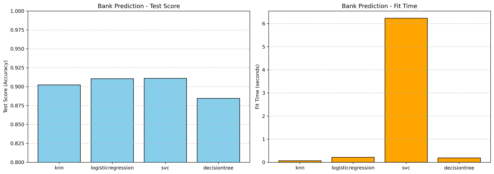
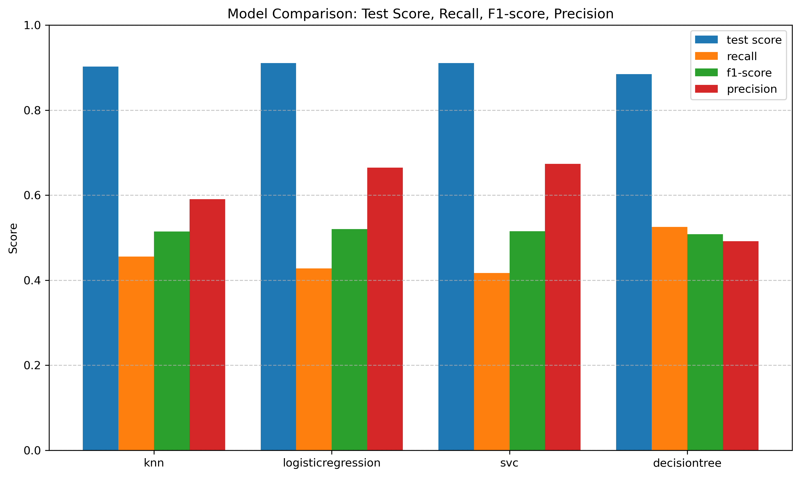
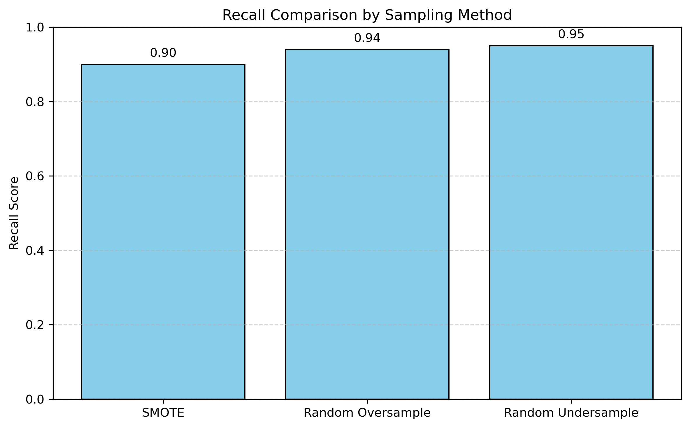

# Practical Application 3 
### Lori Smth
#### Link to file : https://github.com/lorigreensmith06/AI_ML_practical_application_3/blob/main/prompt_III.ipynb

In this practical application 4 models were compared: 
* K Nearest Neighbors
* Linear Regression
* SVC
* DecisionTrees

## The Business Problem

The data was collected from Portugese marketing campaigns that recorded information about customers and whether they agreed to invest in a a long-term loan that was being sold to them.
The data in this dataset was very imbalanced which was challenging.  The data shows that 88% of the customers did not agree to put their money in a long-term loan.  That can be expected in sales data and is not unusual.

## Evaluating the data

Baseline accuracy on test set is 88%.

The data is very imbalanced meaning there are 88% of people who did not agree to the loan and 12% who did.  This created challenges for some of the models.

JamesSteinEncoder was used to encode the categorical data.
The data did not have any empty fields, but did have "unknown" values.  
I tried to replace the "unknown" values with the mode in some cases, but that change did not result in better results than letting the JamesStein Encoder handle the data.  In fact, it often decreased accuracy so I reverted back to just using the James Stein Encoder.

## The Base Models

The base models had about 90% accuracy on the test data and much lower recall.  

Also looking at the coefficients, I realized that I should take out the phone number as that won't have an impact on the results as they are just random numbers. Base on the results perhaps March would be the best time to have a campaign and that May, November and June would be the worst times to run a marketing campaign.

## Improving the Models

The first thing I did was to go back to the data and to try to improve the model using the data. There was no missing data, but there were a lot of unkown fields.  Because I was using the JamesSteinEncoder, the efforts to clean the data didn't seem to make much difference because I suspect that the JamesSteinEncoder was creating a separate category for the "unknown" data.  I did replace the data in columns, "job", "marital", and "education", but left the "default" data to be handled by the encoder.  I did not see an improvement in the models with those changes.

The effort that had the most effect was tuning the hyper-parameters in grid search.  
I added quite a few hyper-parameters to improve performance.  
The decision tree had an improvement with some of the changes. 
They didn't have a huge effect, but I was able to improve the model sometimes by a percentage point so it did make a difference.

* from imblearn.over_sampling import SMOTE
* from imblearn.pipeline import Pipeline as ImbPipeline
* *from imblearn.over_sampling import RandomOverSampler
* *from imblearn.under_sampling import RandomUnderSampler

The final thing that I tried was using some sampling tools to resample the data from the imblearn libraries. This was useful in improving the recall.
That recall value is very important in this instance because the problem has more to lose if the bank loses a sale than spending some resources to have a sales person call the customer.
If the goal was to find the highest recall this was actually very successful.  I was able to find a model with 95% recall.

The accuracy took a hit and went down the 83%, but the RandomUnderSampler produced excellent results for recall.  This means that there are a lot of false positives, but in this case it would just mean that a sales person would get more rejections but would also get more sales. 

## Conclusions
In all cases, using the sampling modules reduced the accuracy, while the recall score went up.

Even thought the accuracy went down, that's not necessarily crucial for this business case. 
A false positive means that you may have to sell to someone who doesn't convert. 
It’s okay to contact more people if it means catching the ones who would actually say yes.
What we want is fewer false negatives because we don't want to miss selling to people who might convert. 
So even though the accuracy went down below the baseline, the sampling models gives us some useful data that can be used by the sales team. 

* SMOTE produced a 90% recall.
* The RandomOverSampler had a 92% accuracy.
* The RandomUnderSampler actually had the highest recall at 93%. 

Because we have a huge majority class we can afford to get rid of some of the majority class with RandomUnderSampling and so underfitting works in this case.

## Recommendations

My recommendation is to use the model that resulted in the highest recall. I would also recommend to do the campaign in March which had the high correlation with positive results. I would also recommend focusing on customers who responded positive to previous campaigns as the coefficients had a high correlation with success for those customers. 